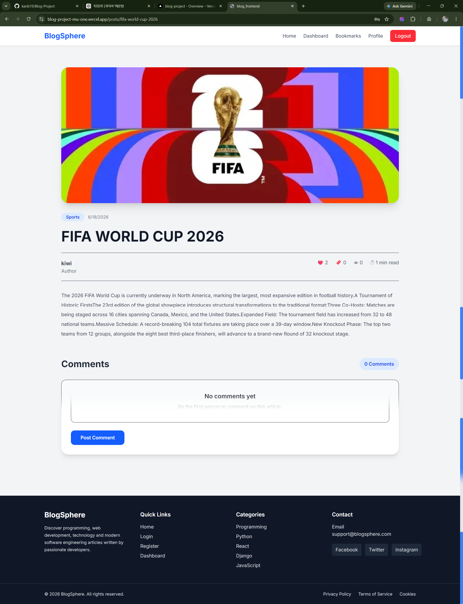
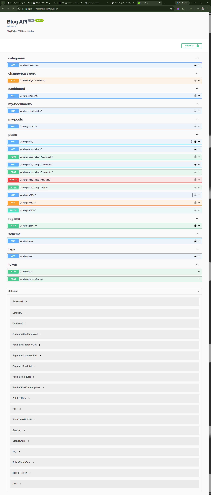

# 📝 Blog Project

A modern full-stack Blog Application built with **Django REST Framework** and **React.js**. Users can register, log in securely using JWT authentication, create and manage blog posts, upload featured images, browse posts by category and tags, and search articles through a clean, responsive interface.

---

# 🌐 Live Demo

### Frontend (Vercel)

**https://blog-project-mu-one.vercel.app/**

### Backend API (Render)

**https://blog-project-l5o3.onrender.com/**

### API Documentation (Swagger)

**https://blog-project-l5o3.onrender.com/api/docs/**

---

# 🚀 Project Overview

This project demonstrates a complete full-stack blog platform using Django REST Framework for the backend and React.js for the frontend. It includes secure authentication, REST APIs, responsive UI, PostgreSQL database integration, Cloudinary image storage, and production deployment.

---

# ✨ Features

## Authentication

* User Registration
* Secure Login (JWT Authentication)
* Logout
* Protected Routes
* User Profile

---

## Blog Features

* Create Blog Posts
* Edit Posts
* Delete Posts
* View All Posts
* Post Details
* Featured Image Upload
* Categories
* Tags
* Search Posts
* Filter by Category
* Filter by Tags
* Ordering
* Pagination

---

## UI Features

* Responsive Design
* Tailwind CSS
* React Router
* Loading Spinner
* Custom 404 Page
* Dashboard Layout

---

# 🛠 Tech Stack

## Frontend

* React.js
* Vite
* React Router
* Axios
* Tailwind CSS

## Backend

* Django
* Django REST Framework
* Simple JWT
* Django Filter
* DRF Spectacular (Swagger)

## Database

* PostgreSQL (Production)
* SQLite (Development)

## Media Storage

* Cloudinary

## Deployment

* Vercel (Frontend)
* Render (Backend)
* Render PostgreSQL Database

---

# 📂 Project Structure

```text
Blog Project Assignment/

├── blog_project/
│   ├── blog/
│   ├── blog_project/
│   ├── manage.py
│   ├── requirements.txt
│
├── blog_frontend/
│   ├── src/
│   ├── public/
│   ├── package.json
│
├── screenshots/
│
└── README.md
```

---

# 📸 Screenshots


```text
screenshots/

Dashboard.png
Home.png
Login.png
Profile.png
Register.png
PostDetails.png
Swagger.png
```


```md
## Home


## Dashboard


## Post Details



## Swagger API


```

---

# ⚙ Installation

## Clone Repository

```bash
git clone https://github.com/karib19/Blog-Project.git
```

---

## Backend Setup

```bash
cd blog_project

python -m venv venv

# Windows
venv\Scripts\activate

pip install -r requirements.txt

python manage.py migrate

python manage.py runserver
```

---

## Frontend Setup

```bash
cd blog_frontend

npm install

npm run dev
```

---

# 🔐 Environment Variables


Backend

SECRET_KEY

DEBUG

DATABASE_URL

CLOUDINARY_CLOUD_NAME

CLOUDINARY_API_KEY

CLOUDINARY_API_SECRET


---

# 🔑 Authentication

This project uses **JWT Authentication**.

Protected endpoints require an access token.

---

# 📌 Main API Endpoints

| Method | Endpoint                    | Description   |
| ------ | --------------------------- | ------------- |
| POST   | `/api/register/`            | Register User |
| POST   | `/api/token/`               | Login         |
| GET    | `/api/posts/`               | All Posts     |
| GET    | `/api/posts/<slug>/`        | Post Details  |
| POST   | `/api/posts/create/`        | Create Post   |
| PUT    | `/api/posts/<slug>/update/` | Update Post   |
| DELETE | `/api/posts/<slug>/delete/` | Delete Post   |
| GET    | `/api/profile/`             | User Profile  |

---

# 🚀 Deployment

## Frontend

* Vercel

## Backend

* Render

## Database

* Render PostgreSQL

## Media Storage

* Cloudinary

---

# 📚 Future Improvements

* Email Verification
* Password Reset
* Rich Text Editor
* User Avatar Upload
* Dark Mode
* Social Sharing
* Notifications
* Related Posts
* Reading Time Estimation

---

# 👨‍💻 Author

**Sharfuddin Karib**

GitHub:

https://github.com/karib19

---

# 📄 License

This project was built for learning purposes and to demonstrate full-stack web development using Django REST Framework and React.js.
