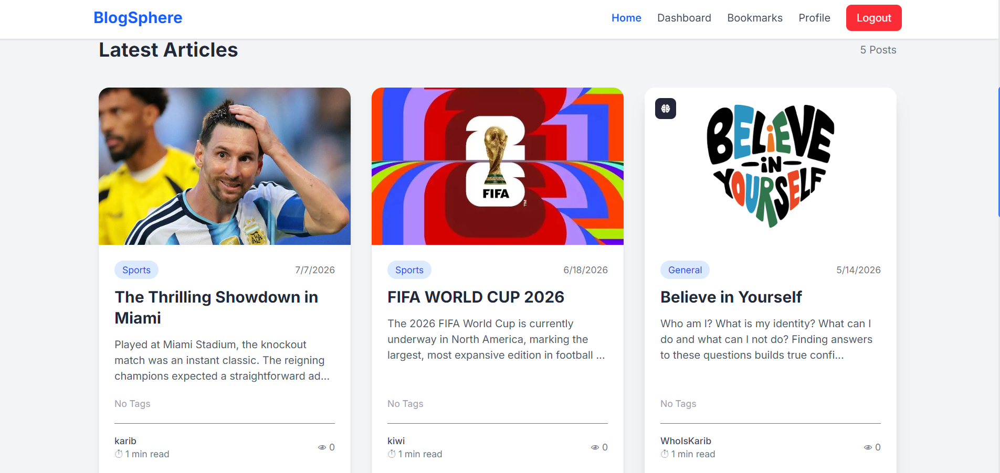
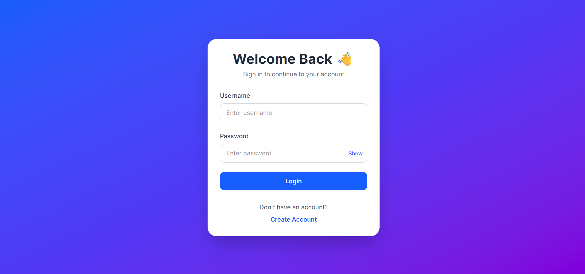
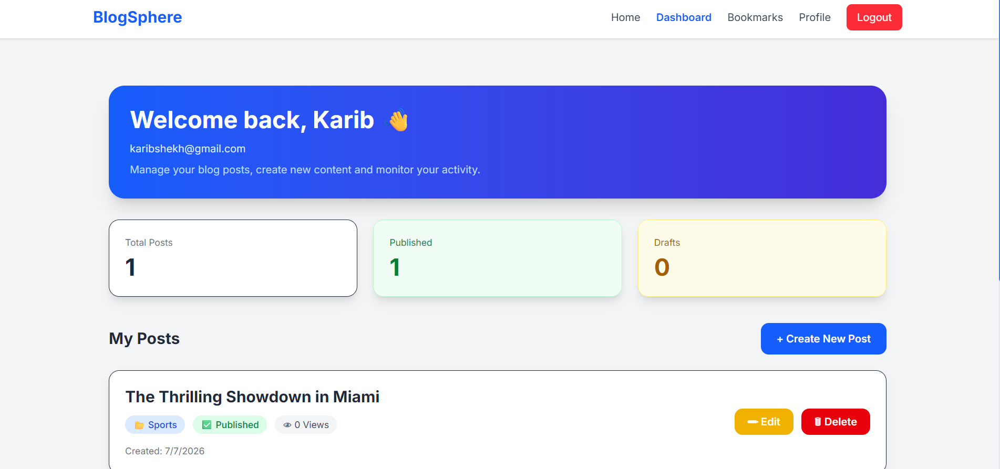

# 📝 Blog Project

A modern full-stack blog application built with **Django REST Framework** and **React.js**. The project allows users to register, log in securely, create and manage blog posts, bookmark articles, like posts, and interact through comments. The frontend is designed with **Tailwind CSS** and communicates with the backend through REST APIs.

---

## 🚀 Project Overview

This project was developed as a full-stack web development assignment to demonstrate CRUD operations, JWT authentication, REST API integration, responsive UI design, and modern frontend development using React.

---

## ✨ Features

### Authentication

* User Registration
* Secure Login (JWT Authentication)
* Logout
* Protected Routes
* Change Password
* Update Profile

### Blog Features

* Create Post
* Edit Post
* Delete Post
* View All Posts
* Post Details
* Featured Image Upload
* Categories
* Tags
* Search Posts
* Filter by Category
* Filter by Tags
* Sort Posts
* Pagination

### User Interaction

* Like Posts
* Bookmark Posts
* Comment on Posts
* View Personal Bookmarks

### UI Features

* Fully Responsive Design
* Tailwind CSS
* Modern Navigation Bar
* Professional Footer
* Loading Spinner
* Custom 404 Page
* Clean Dashboard

---

# 🛠 Tech Stack

## Frontend

* React.js
* React Router
* Axios
* Tailwind CSS

## Backend

* Django
* Django REST Framework
* Simple JWT

## Database

* SQLite

---

# 📂 Project Structure

```
Blog Project Assignment/
│
├── blog_project/
│   ├── blog_project/
│   ├── blog/
│   ├── manage.py
│
├── blog_frontend/
│   ├── src/
│   ├── public/
│   ├── package.json
│
├── screenshots/
│
└── README.md
```

---

# 📸 Screenshots

Place your screenshots inside the **screenshots** folder.

Example:

```
screenshots/
│
├── Home.png
├── Login.png
├── Register.png
├── Dashboard.png
├── Profile.png
└── Bookmarks.png
```

Then display them like this:

```md
## Home



## Login



## Dashboard


```

---

# ⚙ Installation

## Clone Repository

```bash
git clone https://github.com/karib19/Blog-Project.git
```

---

## Backend Setup

```bash
cd backend

python -m venv venv

venv\Source\Scripts\activate

pip install -r requirements.txt

python manage.py migrate

python manage.py runserver
```

---

## Frontend Setup

```bash
cd frontend

npm install

npm run dev
```

---

# 🔐 Authentication

This project uses **JWT Authentication**.

Protected APIs require an access token.

---

# 📌 API Endpoints

| Method | Endpoint                    | Description    |
| ------ | --------------------------- | -------------- |
| POST   | `/api/register/`            | Register       |
| POST   | `/api/token/`               | Login          |
| POST   | `/api/token/refresh/`       | Refresh Token  |
| GET    | `/api/posts/`               | All Posts      |
| GET    | `/api/posts/<slug>/`        | Post Details   |
| POST   | `/api/posts/create/`        | Create Post    |
| PUT    | `/api/posts/<slug>/update/` | Update Post    |
| DELETE | `/api/posts/<slug>/delete/` | Delete Post    |
| GET    | `/api/profile/`             | User Profile   |
| PUT    | `/api/profile/`             | Update Profile |

---

# 📚 Future Improvements

* Dark Mode
* Email Verification
* Password Reset via Email
* Rich Text Editor
* User Avatar Upload
* Social Share Buttons
* Toast Notifications
* Reading Time Indicator
* Related Posts
* Admin Analytics Dashboard

---

# 👨‍💻 Author

**Sharfuddin Karib**

GitHub:
https://github.com/karib19

---

# 📄 License

This project was created for educational purposes as a full-stack web development assignment.
