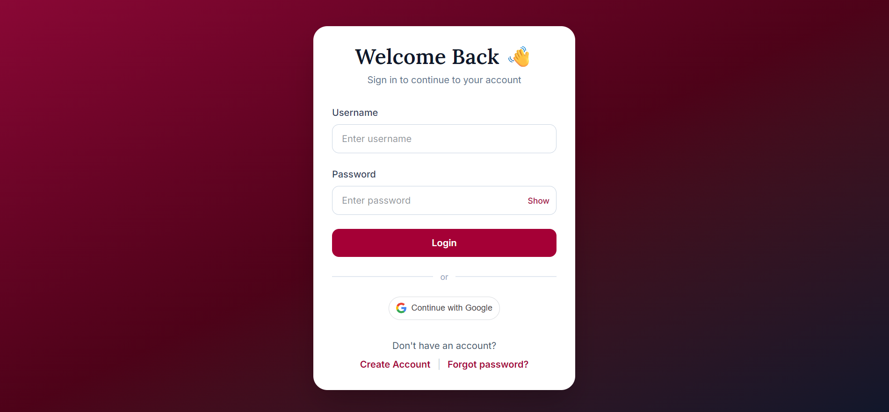
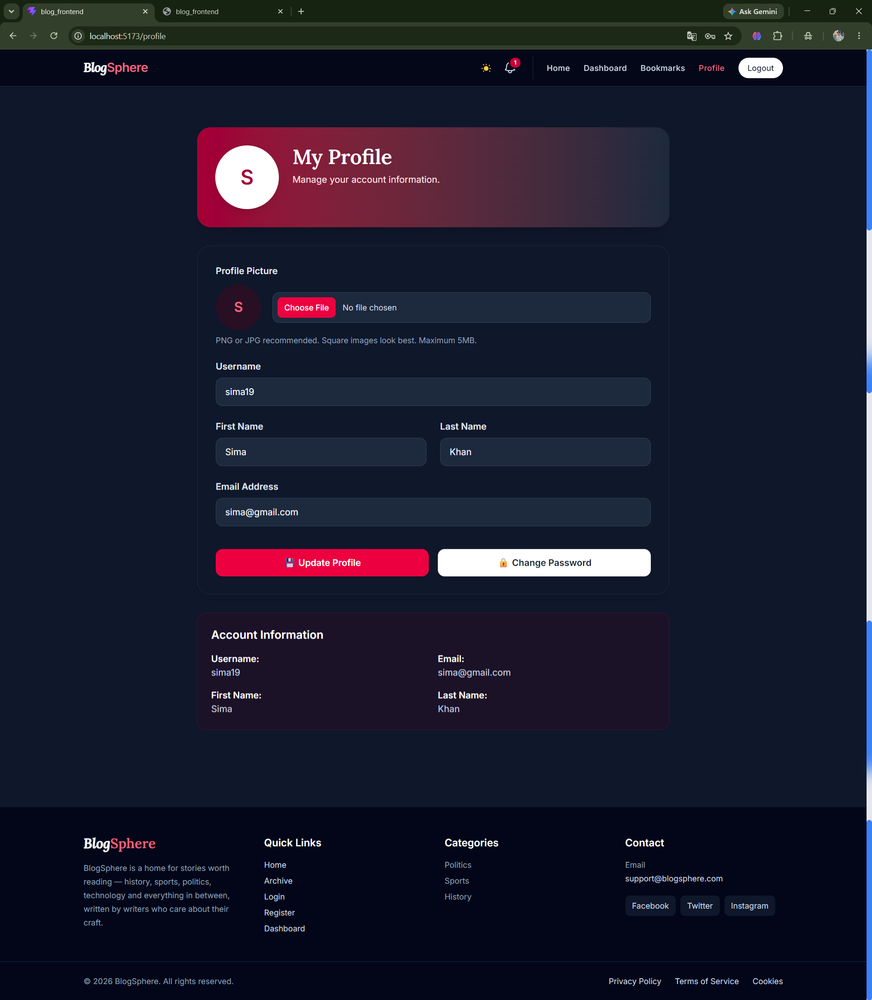
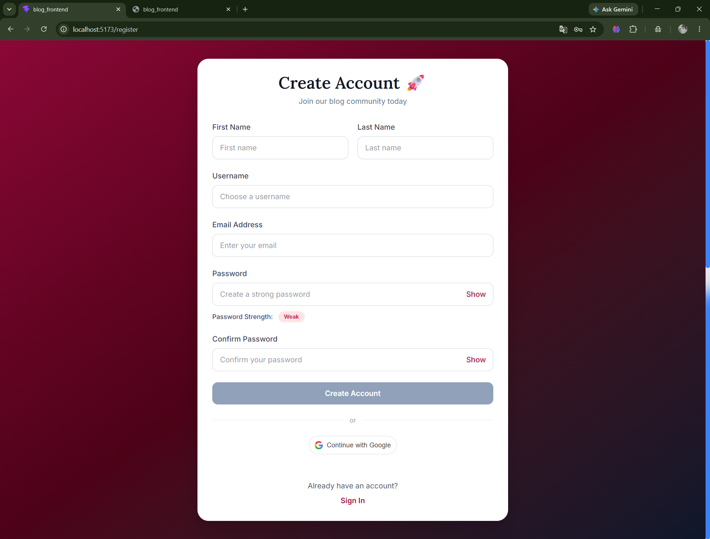

# 📝 Blog Project

A modern full-stack Blog Application built with **Django REST Framework** and **React.js**. Users can register, verify their email via OTP, log in securely using JWT authentication, create and manage blog posts, upload featured images, browse posts by category and tags, and search articles through a clean, responsive interface.

---

# 🌐 Live Demo

### Frontend (Vercel)

**https://blog-project-mu-one.vercel.app/**

### Backend API (Render)

**https://blog-project-1-akx9.onrender.com/**

### API Documentation (Swagger)

**https://blog-project-1-akx9.onrender.com/api/docs/**

> **Note:** The backend runs on Render's free tier, so the very first request after a period of inactivity may take 20–50 seconds while the server wakes up. Subsequent requests are fast.

---

# 🚀 Project Overview

This project demonstrates a complete full-stack blog platform using Django REST Framework for the backend and React.js for the frontend. It includes secure authentication with email verification, REST APIs, responsive UI, PostgreSQL database integration, Cloudinary image storage, hardened security practices, and production deployment.

---

# ✨ Features

## Authentication

* User Registration
* Email Verification (OTP via Brevo)
* Resend OTP
* Password Reset
* Secure Login (JWT Authentication)
* Automatic Access Token Refresh
* Token Blacklisting on Logout (with Refresh Token Rotation)
* Google Login
* Logout
* Protected Routes
* User Profile
* User Avatar Upload
* Rate-Limited Auth Endpoints (brute-force protection)

---

## Blog Features

* Create Blog Posts
* Edit Posts (including Drafts & Scheduled Posts)
* Delete Posts
* View All Posts
* Post Details
* Featured Image Upload
* Categories
* Tags
* Search Posts
* Filter by Category
* Filter by Tags
* Ordering
* Pagination
* Rich Text Editor (Quill)
  * Auto-converts pasted `- ` / `* ` list lines into proper bullet lists
* Draft Auto-Save
* Scheduled Publishing
* Social Sharing (Facebook, X, WhatsApp, Copy Link)
* Notifications
* Reading Time Estimation
* Post View Count
* Related Posts
* Trending & Popular Posts
* Author Profiles & Follow System
* Archive by Month
* Bookmarks
* Comments (with nested replies)
* Likes & Bookmark Counts
* Report / Flag Posts & Comments (with admin moderation)
* SEO Meta Tags & Open Graph / Twitter Card support

---

## UI Features

* Responsive Design
* Tailwind CSS
* React Router
* Loading Spinner
* Custom 404 Page
* Dashboard Layout
* Dark Mode
* Table of Contents (desktop sidebar + mobile drawer)
* Modern Toast Notifications (replacing native browser alerts)
* Custom Confirm Dialogs (replacing native `window.confirm()` for actions like deleting a post)
* Branded Page Title & Meta Tags (browser tab, search results, and social share previews)

---

# 🛠 Tech Stack

## Frontend

* React.js
* Vite
* React Router
* Axios (with automatic JWT refresh interceptor)
* Tailwind CSS
* React Quill (rich text editor)

## Backend

* Django
* Django REST Framework
* Simple JWT (with refresh token rotation & blacklisting)
* Django Filter
* DRF Spectacular (Swagger)
* Bleach + tinycss2 (HTML sanitization to prevent XSS in post/comment content)

## Database

* PostgreSQL via Neon (Production)
* SQLite (Development)

## Media Storage

* Cloudinary

## Email Service

* Brevo (Transactional Email API — used for OTP-based email verification)

## Deployment

* Vercel (Frontend)
* Render (Backend)
* Neon PostgreSQL (Database)

---

# 📂 Project Structure

```text
Blog Project Assignment/

├── blog_project/
│   ├── blog/
│   ├── blog_project/
│   ├── manage.py
│   ├── requirements.txt
│
├── blog_frontend/
│   ├── src/
│   ├── public/
│   ├── package.json
│
├── screenshots/
│
└── README.md
```

---

# 📸 Screenshots

```text
screenshots/

Dashboard.png
Home.png
Login.png
Profile.png
Register.png
PostDetails.png
```

```md
## Dashboard


## Home


## Login API



## Profile API



## Register API



## Post Details


```

---

# ⚙ Installation

## Clone Repository

```bash
git clone https://github.com/karib19/Blog-Project.git
```

---

## Backend Setup

```bash
cd blog_project

python -m venv venv

venv\Scripts\activate

pip install -r requirements.txt

python manage.py migrate

python manage.py runserver
```

---

## Frontend Setup

```bash
cd blog_frontend

npm install

npm run dev
```

---

# 🔐 Environment Variables

## Backend

| Variable | Description |
|---|---|
| `SECRET_KEY` | Django secret key (must be a random, unique value — never hardcode in `settings.py`) |
| `DEBUG` | Must be `False` in production |
| `DATABASE_URL` | PostgreSQL connection string (Neon) |
| `CLOUD_NAME` | Cloudinary cloud name |
| `API_KEY` | Cloudinary API key |
| `API_SECRET` | Cloudinary API secret |
| `BREVO_API_KEY` | Brevo transactional email API key |
| `DEFAULT_FROM_EMAIL` | Sender email address for OTP/password reset emails |
| `GOOGLE_CLIENT_ID` | Google OAuth client ID for Google Login |

## Frontend

| Variable | Description |
|---|---|
| `VITE_API_URL` (or equivalent) | Base URL of the deployed backend API |

---

# 🔑 Authentication

This project uses **JWT Authentication** (via `djangorestframework-simplejwt`).

* Access tokens are short-lived (1 hour); refresh tokens last 7 days.
* The frontend Axios instance automatically intercepts `401` responses, silently refreshes the access token using the refresh token, and retries the original request — so users stay logged in without interruption.
* Refresh tokens **rotate** on every use, and old tokens are **blacklisted** immediately, preventing replay attacks.
* Logging out blacklists the current refresh token server-side (not just cleared from local storage).

## Email Verification Flow

* On registration, the user account is created with `is_active=False` and a 6-digit OTP is generated.
* The OTP is sent to the user's email via **Brevo's Transactional Email API** (HTTPS-based, not SMTP).
* The user submits the OTP to `/api/verify-otp/` to activate their account.
* If the OTP expires or is lost, a new one can be requested via `/api/resend-otp/`.

---

# 🛡 Security Measures

* `DEBUG=False` and a randomly generated `SECRET_KEY` are enforced via environment variables in production.
* **XSS Protection** — All post content (from the rich text editor) and comment content are sanitized server-side with `bleach` before being saved, stripping any `<script>` tags, inline event handlers (`onerror`, etc.), and unsafe `javascript:` links.
* **Rate Limiting / Throttling** — Login, registration, OTP request/resend, and password reset endpoints are throttled to prevent brute-force and spam attacks.
* **Token Blacklisting** — Refresh tokens are blacklisted on logout and rotated on every refresh, limiting the window in which a stolen token can be reused.
* **Report / Flag System** — Users can report posts or comments for spam, harassment, hate speech, misinformation, or other violations. Reports are reviewable and actionable from the Django admin panel.

---

# 📌 Main API Endpoints

| Method | Endpoint | Description |
| ------ | -------- | ----------- |
| POST | `/api/register/` | Register User |
| POST | `/api/verify-otp/` | Verify Email OTP |
| POST | `/api/resend-otp/` | Resend Email OTP |
| POST | `/api/token/` | Login |
| POST | `/api/token/refresh/` | Refresh Access Token |
| POST | `/api/logout/` | Logout (blacklists refresh token) |
| POST | `/api/auth/google/` | Google Login |
| GET/PUT | `/api/profile/` | User Profile |
| POST | `/api/change-password/` | Change Password |
| POST | `/api/password-reset/request/` | Request Password Reset |
| POST | `/api/password-reset/confirm/` | Confirm Password Reset |
| GET | `/api/posts/` | All Posts |
| GET | `/api/posts/<slug>/` | Post Details (published only) |
| GET | `/api/posts/<slug>/edit/` | Post Details for Editing (author only, any status) |
| POST | `/api/posts/create/` | Create Post |
| PUT | `/api/posts/<slug>/update/` | Update Post |
| DELETE | `/api/posts/<slug>/delete/` | Delete Post |
| GET | `/api/posts/trending/` | Trending Posts |
| GET | `/api/posts/popular/` | Popular Posts |
| GET | `/api/my-posts/` | Logged-in User's Posts |
| GET | `/api/my-bookmarks/` | Logged-in User's Bookmarks |
| GET | `/api/dashboard/` | Dashboard Stats |
| GET | `/api/categories/` | List Categories |
| GET | `/api/tags/` | List Tags |
| GET/POST | `/api/posts/<slug>/comments/` | List/Create Comments |
| DELETE | `/api/comments/<id>/delete/` | Delete Comment |
| POST | `/api/posts/<slug>/like/` | Like/Unlike Post |
| POST | `/api/posts/<slug>/bookmark/` | Bookmark/Unbookmark Post |
| POST | `/api/reports/` | Report a Post or Comment |
| GET | `/api/notifications/` | List Notifications |
| GET | `/api/notifications/unread-count/` | Unread Notification Count |
| POST | `/api/notifications/mark-all-read/` | Mark All Notifications Read |
| GET | `/api/author/<username>/` | Author Profile & Posts |
| POST | `/api/follow/<username>/` | Follow/Unfollow Author |
| GET | `/api/archive/` | Archive Summary by Month |

---

# 🚀 Deployment

## Frontend

* Vercel

## Backend

* Render

## Database

* Neon PostgreSQL

## Media Storage

* Cloudinary

## Email

* Brevo (used via REST API to avoid SMTP port restrictions on hosting providers like Render's free tier)

---

# 🩹 Recent Fixes & Improvements

A summary of issues identified and resolved during development:

* **Performance** — Eliminated N+1 query problems on trending/popular/author-profile/bookmarks endpoints by using `select_related`, `prefetch_related`, and `annotate`, and by switching list-type endpoints to a lightweight serializer instead of the full post-detail serializer.
* **Backend/Database Region Mismatch** — Backend and database were previously hosted in different regions (causing multi-second latency on every query); backend was migrated to the same region as the database.
* **Missing Token Refresh Endpoint** — Added `/api/token/refresh/`, which was previously missing, causing users to be logged out whenever their access token expired.
* **JWT Lifetime Tuning** — Configured sensible `ACCESS_TOKEN_LIFETIME` / `REFRESH_TOKEN_LIFETIME` values instead of relying on overly short defaults.
* **Draft Editing Bug** — Editing a draft or scheduled post previously failed (empty form) because the edit page reused the public, published-only post detail endpoint. Added a dedicated author-only edit endpoint.
* **Category/Tag Reselection Bug** — Fixed a data-shape mismatch between the edit endpoint and the edit form that required re-selecting the category/tags on every edit.
* **Rich Text Paste Formatting** — Pasted `- ` / `* ` list-style text into the editor is now automatically converted into proper bullet lists.
* **Production Hardening** — Disabled `DEBUG`, moved `SECRET_KEY` to environment variables, added HTML sanitization (XSS protection), rate limiting on sensitive endpoints, and token blacklisting on logout.

---

# 📚 Future Improvements

* Admin dashboard analytics for authors (views over time, engagement trends)
* Post revision history
* RSS feed & sitemap.xml for SEO
* Two-factor authentication (2FA)
* CAPTCHA on registration/login for additional bot protection

---

# 👨‍💻 Author

**Sharfuddin Karib**

GitHub:

https://github.com/karib19

---

# 📄 License

This project was built for learning purposes and to demonstrate full-stack web development using Django REST Framework and React.js.